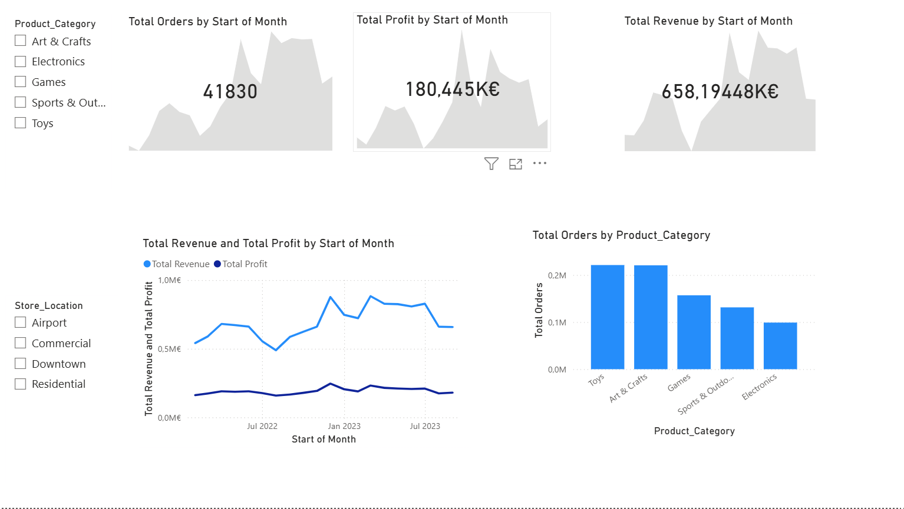

# Maven Toys – Sales & Performance Analysis (Power BI)

## Projektübersicht
Dieses Projekt basiert auf der "Maven Toys Challenge" von Maven Analytics. Ziel war es, die Verkaufs- und Profitdaten einer fiktiven Spielzeugladen-Kette in Mexiko zu analysieren. Das interaktive Dashboard macht die Performance der verschiedenen Produktkategorien und Standorte transparent, um datengetriebene Entscheidungen für zukünftige Expansionsstrategien zu unterstützen.

## Datenbereinigung & Transformation (Power Query)
Die Rohdaten erforderten wichtige Vorbereitungen im ETL-Prozess (Extract, Transform, Load), um sie in der deutschen Power BI-Umgebung nutzbar zu machen:
* **Lokalisierung von Zahlenformaten:** Behebung von Formatierungsfehlern bei Währungen und Preisen. Das US-Format (mit `.` als Dezimaltrennzeichen) musste in das europäische Format (mit `,`) umgewandelt werden. Dies war zwingend notwendig, um die fehlerhaft als Text erkannten Werte in berechenbare Zahlen umzuwandeln.
* **Datentyp-Anpassungen:** Bereinigung der Spalten, um korrekte Währungs- und Dezimalzahlen für die anschließenden Berechnungen sicherzustellen.

## Eigene Berechnungen (DAX)
Das von Power BI automatisch erkannte Datenmodell wurde durch eigene, berechnete Spalten und Metriken erweitert, um die KPIs des Unternehmens zu ermitteln:

**1. Berechnung des Umsatzes (Revenue):**
`Revenue = sales[Units] * sales[Price]`

**2. Berechnung des Gewinns (Profit):**
`Profit = sales[Revenue] - (sales[Cost] * sales[Units])`

## Dashboard & Visualisierungen
Das Dashboard ermöglicht Stakeholdern, die Daten nach Standort (`Store_Location`) und Produktkategorie (`Product_Category`) interaktiv zu filtern. 

**Kern-Visualisierungen:**
* **KPI & Trend-Analyse (Flächendiagramme):** Entwicklung von `Total Orders`, `Total Profit` und `Total Revenue` im zeitlichen Verlauf (Start of Month), um saisonale Spitzen schnell zu erkennen.
* **Umsatz vs. Profit (Liniendiagramm):** Ein direkter Vergleich von Umsatz und Gewinn über die Zeit, um die Profitabilität zu überwachen.
* **Kategorie-Performance (Säulendiagramm):** Ranking der Produktkategorien nach Bestellvolumen. Es zeigt sich deutlich, dass "Toys" und "Art & Crafts" die stärksten Treiber sind.

## Dashboard Screenshot
 
